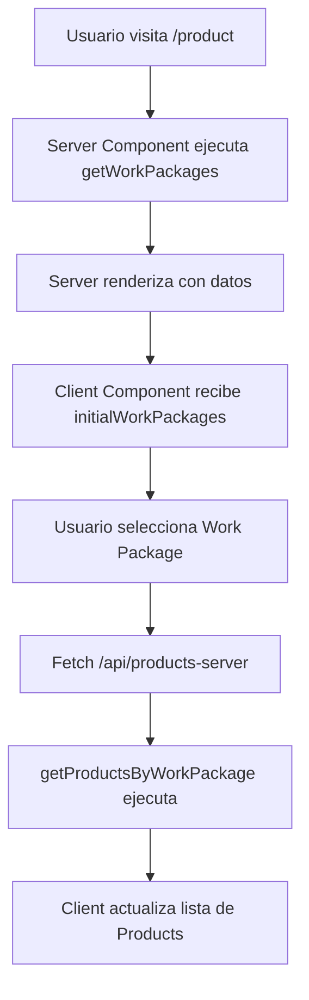

# 🚀 BioFincas - Server Components Configuration

## ✅ Configuración Completada

Tu aplicación ahora usa **Server Components** para mejor rendimiento y simplicidad.

## 🏗️ Arquitectura Actual

```
📦 Server Components Architecture
├── 🖥️  Server (layout.tsx)
│   ├── 🔍 Query: getWorkPackages() 
│   └── 📤 Props: workPackages → Client Component
│
├── 👤 Client (ProductSelectors.tsx)
│   ├── 📥 Recibe: initialWorkPackages
│   └── 🔄 Fetch: products cuando selecciona work package
│
└── 🗄️  Database (PostgreSQL)
    ├── workpackages table
    └── products table
```

## 📁 Archivos Principales

### 🔧 Core Files
- **`src/lib/data-access.ts`** - Funciones de base de datos
- **`src/lib/db.ts`** - Configuración de PostgreSQL
- **`src/app/product/layout.tsx`** - Server Component principal
- **`src/components/product-selectors.tsx`** - Client Component para dropdowns

### 🌐 API Routes
- **`src/app/api/products-server/route.ts`** - API para obtener productos

### 🗑️ Deprecated Files (puedes eliminar)
- `src/hooks/use-data.ts`
- `src/app/api/products/route.ts`
- `src/app/api/work-packages/route.ts`

## 🗄️ Base de Datos

### Configuración en `.env.local`:
```env
DB_HOST=localhost
DB_PORT=5432
DB_NAME=BioFincas
DB_USER=postgres
DB_PASSWORD=2261
```

### Ejecutar SQL de configuración:
```bash
# Conecta a tu PostgreSQL y ejecuta:
psql -h localhost -U postgres -d BioFincas -f database-setup.sql
```

## 🚀 Cómo Usar

### 1. Iniciar Servidor
```bash
npm run dev
```

### 2. Ir a la aplicación
```
http://localhost:3001/product
```

### 3. Funcionamiento
1. **Work Packages** se cargan automáticamente desde el servidor
2. **Selecciona un Work Package** → se cargan los Products filtrados
3. **Selecciona un Product** → se ejecuta el callback

## 🔄 Flujo de Datos



## 💡 Ventajas de Server Components

✅ **Más rápido**: Menos requests de red
✅ **Mejor SEO**: Datos pre-renderizados
✅ **Menos código**: No necesitas hooks complejos
✅ **Más seguro**: Consultas directas en el servidor
✅ **Cacheo automático**: Next.js cachea los Server Components

## 🛠️ Para Desarrollo

### Agregar nuevos Work Packages:
```sql
INSERT INTO workpackages (workpackage_name, description) 
VALUES ('WP-006: Nuevo Módulo', 'Descripción del módulo');
```

### Agregar nuevos Products:
```sql
INSERT INTO products (product_name, workpackage_id, description) 
VALUES ('Nuevo Producto', 1, 'Descripción del producto');
```

### Debugging:
- Revisa la consola del servidor para logs de queries
- Usa `console.log` en `layout.tsx` para debug server-side
- Usa DevTools para debug client-side

## 🎯 Próximos Pasos

1. **Ejecutar el SQL** en tu base de datos
2. **Probar los dropdowns** en la aplicación
3. **Agregar tus datos reales** de BioFincas
4. **Personalizar los nombres** de campos según tus necesidades

¡Tu aplicación está lista para usar Server Components! 🎉
